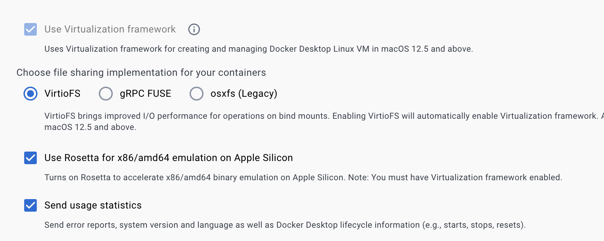
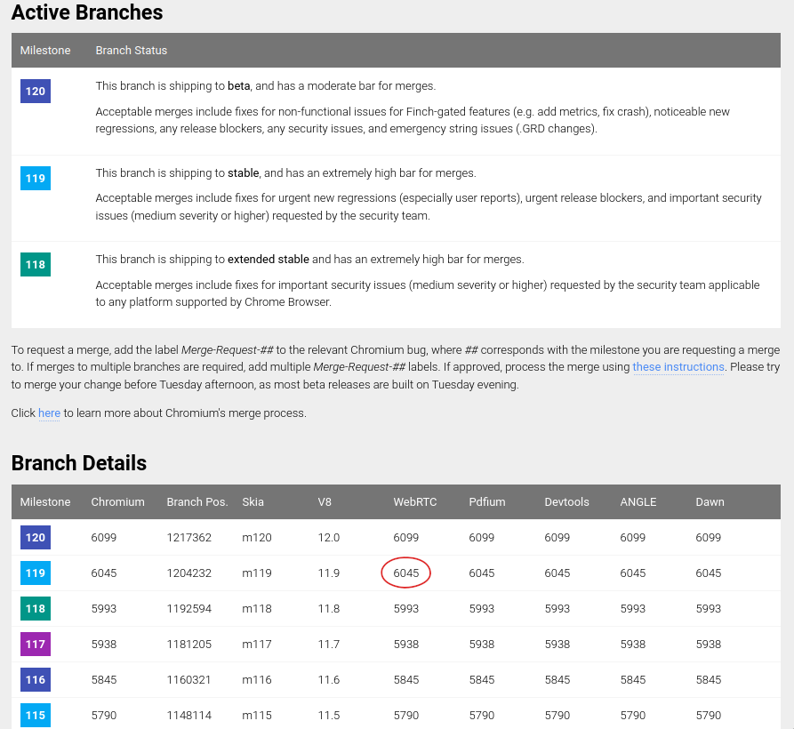
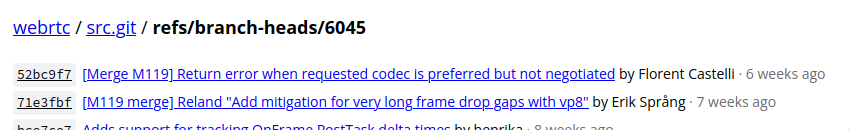

# webrtc-android
Public repo to host a compiled webrtc binary for Android


## 📃 License
* WebRTC License: https://webrtc.org/support/license


## Building

Note: in order to build successfully you should make sure you have about 20GB of free space on your primary hard drive.

### Docker setup

This repository includes a [Dockerfile](Dockerfile) used to build a [Docker container](https://docs.docker.com/get-started/#what-is-a-container) that provides the Linux environment needed to build webrtc-android. To get started you will need to install [Docker Desktop](https://docs.docker.com/get-docker/). (Needed for Windows and macOS. Linux users may install [Docker engine](https://docs.docker.com/engine/install/) instead and use it directly if they want.)

#### MacOS performance settings

For Mac users, particularly those with Apple silicon, there are huge performance improvements from using the correct settings (i.e. going from 1 hour to checkout and 10 hours to build to just 10 and 35 minutes respectively).

First, the OS must be [Ventura or higher](https://en.wikipedia.org/wiki/MacOS_version_history)

Second, rosetta2 must be installed:

```bash
softwareupdate --install-rosetta
```

Finally, the [Docker Desktop](https://docs.docker.com/desktop/settings/mac/) settings must be configured to "Use Virtualization framework" and "Use Rosetta for x86/amd64 emulation on Apple Silicon":



### Create Docker container

Open a terminal/command prompt in this projects directory. Run the following commands to

1. Build the Dockerfile into an image and give it a tag with the name `webrtc-android:latest`
2. Create a [volume](https://docs.docker.com/get-started/05_persisting_data/#container-volumes) named `webrtc-src` that can be used to persist the source directory.
3. Create a container from the image you just built, give it the name `webrtc-android`, and configure the `webrtc` volume to be mounted at `/webrtc-android`

```bash
docker build -t webrtc-android .
docker volume create webrtc-src
docker create -it --name webrtc-android -v webrtc-src:/webrtc-android webrtc-android:latest
```

The `webrtc-android` container is now a small Ubuntu 22.04 environment that should have all the required dependencies to build webrtc-android. It also contains the [build.py](build.py) script, which will be used to actually build the code.

Next, to make sure everything is working as expected, run the following command to run the container and attach to its stdin and stdout. The container's "entrypoint" is the bash shell, which will allow you to execute commands inside the container environment.

```bash
docker start -ia webrtc-android
```

You should see a bash prompt which you can type commands into. To try it out, try running `python3 build.py`. It should print an error message due to not being given any arguments, and short usage summary of the script:

```
build@e88a835beec4:/webrtc-android$ python3 build.py
usage: build.py [-h] [--dir DIR] [--logfile LOGFILE] {fetch,build} ...
build.py: error: the following arguments are required: {fetch,build}
build@e88a835beec4:/webrtc-android$
```

### Fetching the code

With the container created, the next step is to checkout the code. If you were doing this manually, you would probably be following the "Getting the code" part of [these instructions](https://webrtc.github.io/webrtc-org/native-code/android/). However, build.py will handle this for you, with the added ability to checkout the code at a specific revision, which allows you ensure you're building a stable branch.

#### Choosing a revision

We've been building off of the revisions used in stable Chromium milestones. You can see the latest milestones at https://chromiumdash.appspot.com/branches. There is a table showing the latest `beta`, `stable` and `extended-stable` branches for each of the major components of Chromium, including WebRTC. You probably want to choose whatever is the latest of the `stable` and `extended-stable` WebRTC.

In the image below, you can see that at the time this image was created, milestone 119 was the latest non-beta milestone, so we want to find the revision of WebRTC that corresponds to that. To do so, click on the branch number under the WebRTC column (circled in red).



If you click, you should see the Googlesource repository for WebRTC, showing the branch used for the milestone. The branch name is at the top, prefixed by `refs/`. In the image below, you see that the branch name is `branch-heads/6045`. This can be passed to the build.py `fetch` command using the parameter `--revision branch-heads/6045`.



#### Running fetch in the container

Start the container and run the following command in the bash prompt to execute build.py with the `fetch` command, which will setup the gclient configuration and checkout the source code at the revision you want to build:

```bash
python3 build.py fetch --revision branch-heads/6045
```

The script will output a list of the commands it is executing. It also prints the name of a log file to which it writes all the output of each of those commands, to help with debugging if something goes wrong. The full fetch may take a little while. To view the log file afterward, you can use the `less` command.

### Building the code

Still inside the container's bash shell, run the following command to build the source code into an Android .aar library:

```bash
python3 build.py build
```

Again, the full output will be written to a log file. The .aar file will be placed at the `/webrtc-android/src/libwebrtc.aar` path. To extract it and the license file from the docker container, run the following commands:

```bash
docker cp webrtc-android:/webrtc-android/src/libwebrtc.aar .
docker cp webrtc-android:/webrtc-android/src/LICENSE.md .
```

They will be saved in the directory where you are running the command. Then you can simply create a release in https://github.com/ecobee/webrtc-android and upload these files as artifacts. The release tag should be `v<milestone>.0.0`, and the .aar file should be renamed to `libwebrtc-<milestone>.0.0.aar`, e.g. for milestone 119 the tag will be `v119.0.0` and the file name will be `libwebrtc-119.0.0.aar`. It's important to match these naming conventions so the ecobee android app build can fetch the library.

### Clean up

Once you have successfully updated WebRTC, you may want to clean up the docker container, image, and volume, both to reclaim the disk space used and to ensure the next time you build you are using a completely fresh environment. To do this, run these commands:

```bash
docker container rm webrtc-android
docker volume rm webrtc-src
docker image rm webrtc-android
docker image prune
```

## Building with the Github Action

The Github Action takes two inputs, the milestone number, and the branch number of the WebRTC revision to be build. For example, for milestone 119, the inputs would be 6045 for the branch number, and 119.0.0 for the milestone number.

For local testing, [act](https://github.com/nektos/act) can be used. First, follow the instructions in the act repository to install act and Docker as needed. To run the steps for creating and uploading files for a release locally, you will need to provide a GITHUB_TOKEN. See the instructions to do so [here](https://github.com/nektos/act?tab=readme-ov-file#github_token). If you'd like to obtain the files locally, follow the instructions below without providing a token.

Once you have installed act and have checked out this repository, create a json file called events.json with the contents:
```
{
    "action": "workflow_dispatch",
    "inputs": {
        "branch_number": "6045",
        "milestone": "119.0.0"
    }
}
```

Then to run act to dispatch this workflow,
```bash
act workflow_dispatch -e events.json
```

Act will create a docker container for this workflow and another will be created for the webrtc build. If no GITHUB_TOKEN is provided, then the workflow should fail on the Create Release step. To extract the build files from the Docker container, use the commands, replacing act container id and milestone number as needed.

```bash
docker cp {act container id}:$(pwd)/libwebrtc-{milestone number}.aar .
docker cp {act container id}:$(pwd)/LICENSE.md .
```

### Clean up

To clean up the act Docker container, image and volume, use docker container ls, docker volume ls, and docker image ls to obtain the names and ids of them. Then use docker container rm, docker image rm, docker image prune, and docker volume rm, to remove them. Alternatively, you can use the Docker Desktop to remove them.
