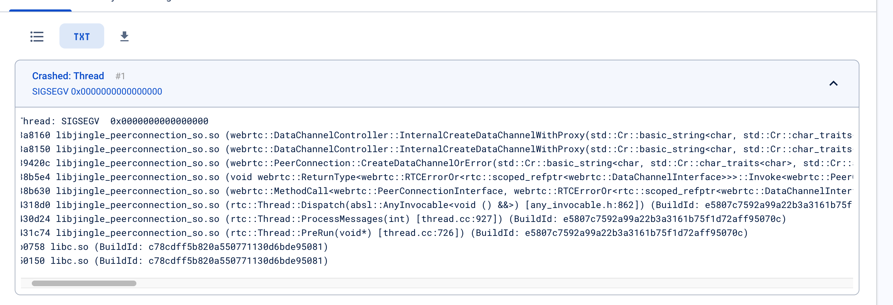

# Debug Symbols for Crashlytics

## Getting webrtc to crash
There's a patch `add-segfault-to-webrtc-src.patch` which adds a bunch of segfaults in various places to get webrtc to crash. These seem to be what's being called in the java native interfaces. 

The jni code is mostly kept in `src/sdk/android/src/jni` for future reference.

### Gradle changes
Need to include "com.google.firebase:firebase-crashlytics-ndk" as a dependency otherwise crashlytics won't report native crashes.

I also enabled crashlytics reporting in `App.kt` for testing in debug builds.

```kotlin
Firebase.crashlytics.setCrashlyticsCollectionEnabled(true)
```

## Building with symbols unstripped
Before uploading the symbols to crashlytics, we first need to actually build webrtc with the native object files unstripped. 

In the build.py script there's an additional option `--unstripped`, which will pass `--use-unstripped-libs` to the `/webrtc-android/src/tools_webrtc/android/build_aar.py`. This will build the .so files with the symbols unstripped.

Warning, the generated `.aar` file will much larger than the stripped version (50MB -> 200MB)

See the comments in that `build_aar.py` to learn more. 

**Note**: once the debug symbols are uploaded, we get the symbolic stack trace regardless of if we use the stripped or unstripped version of the library we actually build the app with.

### Verifying symbols
Here's one way to verify that the .aar file contains the unstripped symbols.

```bash
# this extracts the contents to the current directory
jar -xf libwebrtc.aar
cd jni
# one of the arm/x86 directories
cd arm64-v8a
# this will have an empty symbol table if we don't set the --use-unstripped-libs option
objdump --syms libjingle_peerconnection_so.so
```

## Uploading symbols
Add/replace the `libwebrtc.aar` file in the `webrtc-module` under the `build` folder. Then execute this command to upload the symbols. 


```bash
  firebase crashlytics:symbols:upload --app=FROM_CRASHLYTICS_PROJECT_SETTINGS webrtc-module/build
```

First do a dry run and verify the symbols in the output path given. If we don't specify a dry run, crashlytics will automatically clean this file up after uploading.

Example output:
```bash
jason.z$ firebase crashlytics:symbols:upload --dry-run --app=FROM_CRASHLYTICS_PROJECT_SETTINGS webrtc-module/build
i  Generating symbols for webrtc-module/build
i  Generated symbols for webrtc-module/build
i  Output Path: /var/folders/df/5sjy9fd951lfn_2_b9m99hvsnrq67s/T/crashlytics-406a37cc-e90f-4bb1-9681-fcf4443726c3/nativeSymbols/1-650884121576-android-a13e0ef8b687ff32/breakpad
i  Skipping upload because --dry-run was passed
```

## Verifying crashes
Launch the app normally, replacing the normal `libwebrtc-XXX.X.X.aar` with the newly built one. Going into the camera live view should crash the app.

You should get something like this
```
2024-01-29 09:09:46.064 18024-18297 libc                    com.ecobee.athenamobile              A  Fatal signal 11 (SIGSEGV), code 1 (SEGV_MAPERR), fault addr 0x0 in tid 18297 (signaling_threa), pid 18024 (ee.athenamobile)
2024-01-29 09:09:46.160 18307-18307 DEBUG                   pid-18307                            A  pid: 18024, tid: 18297, name: signaling_threa  >>> com.ecobee.athenamobile <<<
2024-01-29 09:09:46.161 18307-18307 DEBUG                   pid-18307                            A        #00 pc 00000000003a8160  /data/app/~~cHI8BUm6leVjr4l_S81EHg==/com.ecobee.athenamobile-EovMzI07FxCM2AgSEF3NWA==/base.apk!libjingle_peerconnection_so.so (offset 0x6f16000) (BuildId: e5807c7592a99a22b3a3161b75f1d72aff95070c)

```

### Logcat for crashlytics events
Useful to see if a crashlytics report was generated and uploaded during crashes

```bash
adb -s HT84J1A01515 logcat -s FirebaseCrashlytics -v color
```

## View the stack trace on crashlytics
See an example stack trace [here](https://console.firebase.google.com/u/0/project/ecobee-dev/crashlytics/app/android:com.ecobee.athenamobile/issues/d088ac2faef59a8d0f64c32d4f3c22d5?time=last-seven-days&sessionEventKey=65b7b1a0008b00014668491c2768956c_1907967860473654665)

**Note:** the `libc.so/libart.so` stack frames are system libraries for [which crashlytics doesn't have visibility](https://groups.google.com/g/firebase-talk/c/9TFRAoEUauU)



